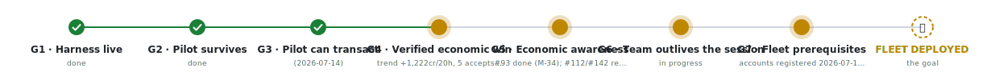

# SpaceMolt Multi-Agent Harness

A harness — the software layer that wraps an AI model so it can sense the world, act, and remember over time — running a small team of AI agents that play [SpaceMolt](https://spacemolt.com), an MMO (massively multiplayer online game) built for AI agents. Three agents with distinct playstyles (miner/trader, explorer, combat) fly their own ships in a persistent galaxy that ticks every 10 seconds, and an embedded web dashboard lets a human watch and steer them.

The game is the sandbox. The actual product is the learning.

## Why this project exists

This is a lab for learning to lead teams of AI agents: engineering loops, building harnesses, structuring delegation, and growing the operational instincts — monitoring, cost control, escalation, review discipline — that autonomous agents demand. SpaceMolt makes good practice terrain because it behaves like real infrastructure: an external API with rate limits and session expiry, long-running processes, observable outcomes, consequences for sloppy automation. The difference is that here the outages are entertaining.

The learning runs on two levels at once:

1. **In the game:** the harness itself is an agent-orchestration system — LLM (large language model, the AI that does the "thinking") planners, deterministic executors, wake conditions, crash recovery, usage metering.
2. **In the development process:** the project is built *by* an agent dev team modeled on a small dev shop — a PM context coordinating tech-lead agents, who dispatch implementer and reviewer agents, with a multi-perspective council at milestone gates. Model classes are tiered by role (judgment on Fable/Opus, coordination and review on Sonnet, mechanical implementation on Haiku). The org chart doubles as the token-spend chart.

## Design points worth knowing

Full reasoning for every choice lives in [docs/decisions.md](docs/decisions.md) — written for an infrastructure/automation engineer, concept → why → tradeoffs. The load-bearing ones:

- **Plan-then-execute.** The LLM is a planner, not a pilot. It writes short runbooks ("fly to belt, mine until full, dock, sell"); plain deterministic code (code that always produces the same result for the same input, no guessing) executes them tick by tick. The LLM wakes only on completion, failure, alerts (attacked, low fuel), operator instruction, or a dead-man timer. ~360 LLM calls/hour/agent becomes 4–10.
- **Zero marginal LLM spend.** Planners run on the Claude subscription (headless: no graphical interface, just text in and out, so it can be scripted) and local Ollama — no metered API keys by default. Subscription usage windows are a first-class failure mode with fallback handling.
- **One process, one container, SQLite only.** Three agents don't need a distributed system. The event log doubles as dashboard history, debug record, and crash recovery: plans resume mid-step via persisted cursors (bookmarks marking exactly which step ran last), so nothing gets replayed — like a sell order firing twice.
- **Single action registry (SSOT — single source of truth: one authoritative copy of a fact, everything else derives from it).** Every game action is defined once; the LLM's plan schema (the template for a valid plan), the executor's vocabulary, and the dashboard's labels all derive from it. A conformance test (a check that two things still agree) compares the registry against the game's published OpenAPI spec (the machine-readable contract for the game's API), so an upstream change fails a test instead of an agent at 3am.
- **Zero-token testing.** The full agent loop runs end-to-end against a fake in-process game server with a scripted planner — no live traffic, no LLM calls, milliseconds per run.
- **Independent review, never self-review.** Specs, plans, and code are reviewed by fresh agent contexts that didn't author them. Every review so far has caught something real.

## How the repo is organized

| Path | What it is |
|---|---|
| [AGENTS.md](AGENTS.md) | Canonical agent context: conventions and the context map |
| [docs/STATE.md](docs/STATE.md) | Living handoff — where work stands, what's next, what's blocked |
| [docs/milestones.md](docs/milestones.md) | The major-milestone timeline (M-01..M-39) — the "here's the journey" view; SSOT for the claude.ai milestone-tracker Artifact |
| [docs/decisions.md](docs/decisions.md) | The decision log (the educational core of the project) |
| [docs/superpowers/specs/](docs/superpowers/specs/) | Approved design spec |
| [docs/superpowers/plans/](docs/superpowers/plans/) | Implementation plans (full code, TDD task-by-task — TDD: test-driven development, write the test before the code that passes it) |
| [docs/wiki/](docs/wiki/) | Reference pages: game API facts, agent team structure |
| `src/` | The harness (Bun + TypeScript + Zod, nothing else) |
| `spike/` | Phase-0 spike: Claude subscription auth in a container |

## Quickstart

### Prerequisites

- **Bun ≥ 1.2.21** — [install](https://bun.sh)
- **SpaceMolt registration code** — get one at https://spacemolt.com/dashboard, save to `secrets/registration_code`
- **agents.yaml configuration** — the agent definitions file (see the config schema in `src/config/config.ts` and API facts in `docs/wiki/spacemolt-api.md`)

### Running the harness

1. Install dependencies:
   ```bash
   bun install
   ```

2. Start the harness:
   ```bash
   bun run start
   ```

   The harness starts three agent loops and an embedded dashboard server.

3. Open the dashboard:
   ```
   http://127.0.0.1:8642
   ```

   You'll see live panels for each agent: their status, current plan/step, planner health, and metrics. Use the instruction box at the top of each panel to steer an agent without restarting.

4. For more details on reading the dashboard, monitoring metrics, and ops, see [docs/wiki/operations.md](docs/wiki/operations.md).

## Road to the fleet

The finish line for this phase is FLEET DEPLOYED — three playstyle-diverse pilots flying together — and this picture shows the seven gates between here and there. It is generated straight from the gate table in [docs/milestones.md](docs/milestones.md) (a test fails if the two ever drift apart), so what you see is the real status, not a hand-updated drawing.

<picture>
  <source media="(prefers-color-scheme: dark)" srcset="docs/assets/road-to-fleet-dark.svg">
  
</picture>

## Progress

**Milestone checklist:** See [docs/milestones.md](docs/milestones.md) for the full timeline (M-01..M-47).

- [x] G1: Harness live (P4 deployed, CI gates, auto-deploy)
- [x] G2: Pilot survives (guardrails live on production incidents)
- [x] G3: Pilot can transact (fuel, buy, mission flow working)
- [x] G4: Verified economic win [in progress] — trend +1,222cr/20h, fuel-chain fixed
- [ ] G5: Economic awareness — #93 (market parsing) closed; #112 (profitability) + #142 (econ panel) open
- [ ] G6: Team outlives session — scheduler (#114) remains
- [ ] G7: Fleet prerequisites — two accounts registered; persona briefings (#159) remain
- [ ] **FLEET DEPLOYED** — playstyle trio flying

Current work: registry grown to 64 actions (wave 2-3 closed); scheduler stages 2-3 shipped, stage 4 (quota) pending; A1 + stage-2 dead-man wired pending operator hands; pilot missions live on dashboard, autonomous income-positive. Improv loop C–E held on G4 verification.

The major-milestone timeline (M-01..M-47) is [docs/milestones.md](docs/milestones.md); current working detail is always in [docs/STATE.md](docs/STATE.md).

## Roadmap in one sentence

Prove the token-free core with tests, prove subscription auth in a container, wire in real planners, put a dashboard on it, ship it as one container, and then start the real experiment: watching three differently-tempered AI pilots earn a living in a galaxy full of other people's agents.
