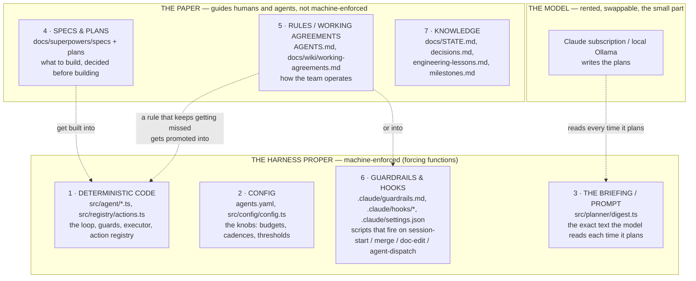
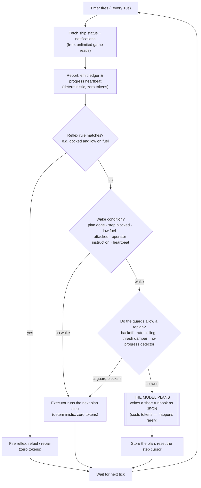
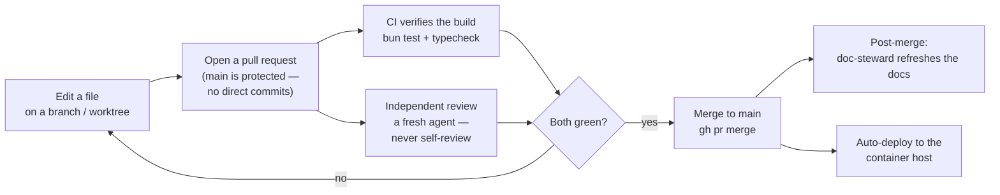

# Anatomy of the Harness: what it's made of, and how you change each part

The operator kept asking one question in different words: *when I want to change how the agents behave, what exactly am I editing?* A markdown file? A spec? Config? Deterministic code that fires on a hook? The answer is "any of those, and picking the right one is the most important decision." So this page and its companion lay out every part the harness is made of, what each one is, and how a human changes it. The organizing idea and the two maps live here; the part-by-part detail lives in `docs/wiki/harness-parts.md`.

If you want the ground floor first ("what is a harness, what is a loop", the brain-in-a-jar analogy), read `docs/wiki/harness-concepts.md`. This page assumes it and goes one level up: the parts inventory and the edit surface.

## The one idea that organizes everything: prose vs. forcing function

Start here, because this idea decides which part you edit.

A **rule in prose** is a sentence about what *should* happen. "Sell your cargo when you're docked at a market." "Never dock where there's no station." "Refresh the handoff doc after every merge." Prose is read by a model (or a human), and a model is a smart but forgetful reader. It might follow the rule. It might not, especially a cheaper model, or one distracted by a long context. Prose guides judgment; it guarantees nothing.

A **forcing function** is machinery that *makes* the thing happen, or blocks the wrong thing, with nobody needing to remember anything: deterministic code that auto-refuels the ship; a schema that rejects an invalid value at startup instead of silently ignoring it; a hook script that fires the instant you run a merge. Machinery like this doesn't guide judgment; it removes the need for it.

This is the project's central lesson, stated in `docs/wiki/engineering-lessons.md` as *Agent = Model + Harness*: an agent that misbehaves usually has a missing forcing function, not a dumb model. Reliability comes from moving a rule out of "the model should remember this" into something that cannot be forgotten. The guardrails file (`.claude/guardrails.md`) ranks the options, strongest first:

1. **Automate it away**: the system just does it; nothing to remember.
2. **Gate the trigger**: a check fires at the exact moment the rule is relevant.
3. **Just-in-time re-inject**: surface the rule into view right when it's needed. The weakest tier, used only when no script can do the job for you.

So the practical decision aid, which the rest of this page hangs on:

> **Want it to ALWAYS happen (or never happen)? Reach for code, config, or a hook.**
> **Want to guide a judgment call the model has to make? Reach for prose (a briefing line or a rule).**

One real example shows the same rule living in both places at once. The game has exactly five chat channels. The briefing (`src/planner/digest.ts`) tells the model in prose, "chat target must be one of five channels: local, system, faction, private, emergency." That's the nudge. But a model once guessed a sixth channel, "broadcast," and the game silently dropped every message. So the same rule is also enforced in the action registry (`src/registry/actions.ts`): `target: z.enum(CHAT_CHANNELS)` rejects any value outside the five before it can ever reach the game. The prose helps the model pick right the first time; the enum guarantees a wrong pick can't get through. Weak layer and strong layer, same rule.

## The map: what the harness is made of

The harness has seven parts, in three groups by how hard they bind behavior.

Notice the dotted arrows; they answer "how do I make something reliable." A rule that starts as paper (a working agreement) is promoted into an enforced part (code or a hook) once it proves it keeps getting missed. The briefing (part 3) is the odd one out. It lives inside the harness and you fully control it, yet what it holds is prose the model may or may not follow, so it behaves like paper even though you edit it like code. That tension is exactly why parts 1 and 6 exist to back it up.

Parts near the top of the diagram force outcomes; parts near the bottom inform choices. When you want to change agent behavior, you are almost always editing one of these seven. Each gets a full section in `docs/wiki/harness-parts.md`: what it is, why it exists, and how you change it, with real examples.

## The loop: where the model plans and where code runs

Before the parts, watch them move together. Every ~10 seconds the deterministic loop wakes, looks at the ship, and does the cheapest thing that fits. Most ticks it just runs the next step of a plan the model already wrote, at zero token cost. It pays for the model only when something happens that a running plan can't handle, and even then a stack of guards can rule that the moment doesn't warrant a fresh plan. Follow the arrows: the expensive box (the model planning) is reached rarely, and everything else is deterministic code.

The shape of that diagram is the whole cost-and-reliability strategy. The naive design would call the model in place of every deterministic box, hundreds of times an hour. Here the model is one box, guarded on all sides, reached only when judgment is needed. So deterministic code (part 1) is the bulk of the harness, and the model is the small, swappable part.

## How a change ships

Whichever part you edit, the change reaches the running agents the same way. Nothing lands directly on the main branch. Every change goes through a pull request, gets verified and reviewed, and only then merges and deploys.

The two gates in the middle are themselves forcing functions. CI (`bun test && bun run typecheck`) mechanically blocks a change that breaks the build or the types; it runs against a fake game server and a mocked model, so it costs zero tokens and touches no live game. Independent review is a standing rule (part 5) that a fresh context, never the author, checks the work, because an author re-reads their own assumptions as facts. Only after both pass does the merge happen. Merging triggers the deploy to the container running the agents, and a doc-steward pass (part of a merge cluster's definition-of-done) brings the knowledge layer back up to date.

## Putting it together: which part do I edit?

The part numbers refer to the seven parts detailed in `docs/wiki/harness-parts.md`.

| I want to... | Edit this part | Strength |
|---|---|---|
| Make the agent *always* do X in situation Y | Deterministic code / a guard (part 1) | Forces it |
| Stop an invalid value ever reaching the game | The registry schema (part 1) | Blocks it |
| Change *how much* / *how often* (a threshold, a budget, which model) | Config, `agents.yaml` (part 2) | Forces it, no code |
| Nudge the model's judgment when it plans | The briefing, `digest.ts` (part 3) | Guides only |
| Enforce something at a workflow moment (merge, session start) | A hook (part 6) | Gates it |
| Decide what to build next | A spec/plan (part 4) | Guides building |
| Set how the team operates | A working agreement (part 5) | Guides, until promoted |
| Record what happened and why | The knowledge layer (part 7) | Informs |

The judgment running through the whole table is the opening idea. If a behavior must hold, don't leave it in prose where a model might forget it; move it into code, config, or a hook where it can't be. Prose is for the judgment calls that need a mind. Everything else wants machinery. That single distinction separates a harness that mostly works from one you can leave running unattended.
